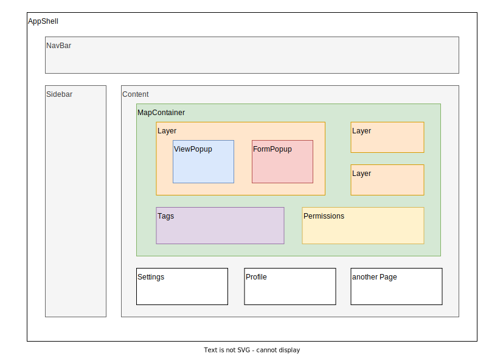

# Utopia UI [](https://www.npmjs.com/package/utopia-ui)   

**UI Framework for Real-Life-Networking-Apps**

*Real change happens in real life when we meet in person and connect as local communities manifesting their ideas with the earth. When we help each other to step out of our bubbles at home and start building common infrastructure to meet human needs in harmony with Mother Earth.*

*That is why Utopia UI exists. It is a UI kit for minimalist, fast, intuitive and mobile-first map apps, as a tool for local connection and decentralised networking. We believe in maps as the perfect link between digital tools and real life action* 

*It can work with any backend or p2p database and any kind of data structure.*

## Mission 
Utopia UIs mission is to provide open source building blocks to create beautiful applications with a focus on real life impact, local communities and gamification. 

The building blocks are designed to allow different networks and communities to assemble their map and app for their specific needs and purpose.

It is the base of [Utopia Map](https://github.com/utopia-os/utopia-map) and [Utopia Game](https://github.com/utopia-os/utopia-game).

## Features

* Interactive Component Map with customizable Layers (like Projects, Event, People)
* Flexible API-Interface to make it work with every backend or p2p database
* Create, Update, Delete Items
* User authentification API-Interface
* Customizable Profiles for users and other items
* App shell with navigation bar and sidebar

## Getting Started

### Basic Map
In this tutorial we learn how we create a basic React app with a Map component using [utopia-ui](https://github.com/utopia-os/utopia-ui) library.

For this tutorial we use Vite to create an empty React app called "utopia-static-map"

```shell
npm create vite@latest utopia-static-map -- --template react
```

We open our new app in the terminal and install the [utopia-ui](https://github.com/utopia-os/utopia-ui) package

```shell
cd utopia-static-map
npm install utopia-ui
```

We open our `src/App.jsx` and we replace the content with

```jsx
import { UtopiaMap } from "utopia-ui"

function App() {
  return (
    <UtopiaMap center={[50.6, 9.5]} zoom={5} height='100dvh' width="100dvw">
    </UtopiaMap>
  )
}

export default App

```

Then we start the development server to check out the result in our browser:

```shell
npm run dev
```

And can open our first map app in the browser 🙂

### Static Layers

Now we add some static content in two layer.

First we put some sample data in a new file called `src/sample-data.js`

```javascript
export const places = [{
    "id": 51,
    "name": "Stadtgemüse",
    "text": "Stadtgemüse Fulda ist eine Gemüsegärtnerei in Maberzell, die es sich zur Aufgabe gemacht hat, die Stadt und seine Bewohner:innen mit regionalem, frischem und natürlich angebautem Gemüse mittels Gemüsekisten zu versorgen. Es gibt also jede Woche, von Frühjahr bis Herbst, angepasst an die Saison eine Kiste mit schmackhaftem und frischem Gemüse für euch, welche ihr direkt vor Ort abholen könnt. \r\n\r\nhttps://stadtgemuese-fulda.de",
    "position": { "type": "Point", "coordinates": [9.632435, 50.560342] },
  },
  {
    "id": 166,
    "name": "Weidendom",
    "text": "free camping",
    "position": { "type": "Point", "coordinates": [9.438793, 50.560112] },
  }];
  
  export const events = [
    {
      "id": 423,
      "name": "Hackathon",
      "text": "still in progress",
      "position": { "type": "Point", "coordinates": [10.5, 51.62] },
      "start": "2022-03-25T12:00:00",
      "end": "2022-05-12T12:00:00",
    }
  ]
```

We want to create two Layers. One we want to call *Places* and the other *Events*

we import our sample data to the `src/App.jsx`

```jsx
import { events, places } from "./sample-data"
```
and than we create our two `<Layer>` inside of our `<UtopiaMap>` component
```jsx
    <UtopiaMap center={[50.6, 15.5]} zoom={5} height='100dvh' width="100dvw">
      <Layer
        name='events'
        markerIcon='calendar'
        markerShape='square'
        markerDefaultColor='#700'
        data={events} />
      <Layer
        name='places'
        markerIcon='point'
        markerShape='circle'
        markerDefaultColor='#007'
        data={places} />
    </UtopiaMap>

```
## Components



## Map Component
The map shows various Layers (like places, events, profiles ...) of Items at their respective position whith nice and informative Popup and Profiles.

Tags, colors and clusters help to retain the overview.


### Map Options

 Option         | Type              | Default      | Required   | Description 
 ---            | ---               | ---          | ---        | ---    
 `height`       | `string`          |`'400px'`     |    No      | height of the map           
 `width`        | `string`          |`'100vw'`     |    No      | width of the map
 `center`       | `LatLng`          |`[50.6, 9.5]` |    No      | initial map position           
 `zoom`         | `number`          |`10`          |    No      | initial zoom level

### Layer Options

 Option         | Type              | Default      | Required   | Description 
 ---            | ---               | ---          | ---        | ---    
|      ...      |                   |              |            |

## Join the community

*This Library is in alpha stage. You are very welcome to participate in the development*

*We are looking for Web Developer, UX Designer, Community Manager, Visionaries, Artists, etc. who like to support this Vision.*

[https://t.me/UtopiaMap](https://t.me/UtopiaMap)

## Support us

<a href="https://opencollective.com/utopia-project">
    
</a>
